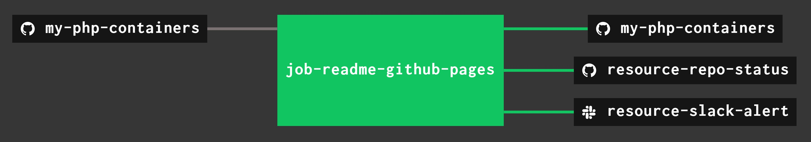

# my-php-containers

[](https://codeclimate.com/github/JeffDeCola/my-php-containers)
[](https://codeclimate.com/github/JeffDeCola/my-php-containers/issues)
[](http://jeffdecola.mit-license.org)

`my-php-containers` _is a place to keep my php container examples.
Designed for Dynamic Screen Widths._

[GitHub Webpage](https://jeffdecola.github.io/my-php-containers/)

## PHP CONTAINERS

* [jeffs_tiny_url_container](https://github.com/JeffDeCola/my-php-containers/tree/master/jeffs_tiny_url_container)
[(_see offsite demo_)](http://www.jeffryadecola.com/my-php-containers/index.php?container_name=jeffs_tiny_url_container)

   _Shorten Long URLs to Tiny URLs._

* [jeffs_simple_chat_container](https://github.com/JeffDeCola/my-php-containers/tree/master/jeffs_simple_chat_container)
[(_see offsite demo_)](http://www.jeffryadecola.com/my-php-containers/index.php?container_name=jeffs_simple_chat_container)

   _Coming Soon._

* [narrow_picture_container](https://github.com/JeffDeCola/my-php-containers/tree/master/narrow_picture_container)
[(_see offsite demo_)](http://www.jeffryadecola.com/my-php-containers/index.php?container_name=narrow_picture_container)

   _Allow a picture to scale and display across the screen._

* [social_media_bar_container](https://github.com/JeffDeCola/my-php-containers/tree/master/social_media_bar_container)
[(_see offsite demo_)](http://www.jeffryadecola.com/my-php-containers/index.php?container_name=social_media_bar_container)

   _Provide links to social media, built with Dynamic Items Container._

* [dynamic_items_container](https://github.com/JeffDeCola/my-php-containers/tree/master/dynamic_items_container)
[(_see offsite demo_)](http://www.jeffryadecola.com/my-php-containers/index.php?container_name=dynamic_items_container)

   _Displays items (e.g. Menu) that will center and collapse properly
on smaller screens._

* [contact_form_container](https://github.com/JeffDeCola/my-php-containers/tree/master/contact_form_container)
[(_see offsite demo_)](http://www.jeffryadecola.com/my-php-containers/index.php?container_name=contact_form_container)

   _An online contact form that is sent to an email._

* [video_container](https://github.com/JeffDeCola/my-php-containers/tree/master/video_container)
[(_see offsite demo_)](http://www.jeffryadecola.com/my-php-containers/index.php?container_name=video_container)

   _For Youtube or Vimeo with optional background._

## GITHUB WEBPAGE UPDATED USING CONCOURSE

A Concourse Pipeline will automatically update the GitHub WebPage.



A _ci/.credentials.yml_ file needs to be created for your _slack_url_ and _repo_github_token_.

Use fly to upload the the pipeline file _ci/pipline.yml_ to Concourse:

```bash
fly -t ci set-pipeline -p my-php-containers -c ci/pipeline.yml --load-vars-from ci/.credentials.yml
```

## CONCOURSE RESOURCES IN PIPELINE

`my-php-containers` also contains a few extra concourse resources:

* A resource (_resource-slack-alert_) uses a [docker image](https://hub.docker.com/r/cfcommunity/slack-notification-resource)
  that will notify slack on your progress.
* A resource (_resource-repo-status_) use a [docker image](https://hub.docker.com/r/dpb587/github-status-resource)
  that will update your git status for that particular commit.

The above resources can be removed from the pipeline.
