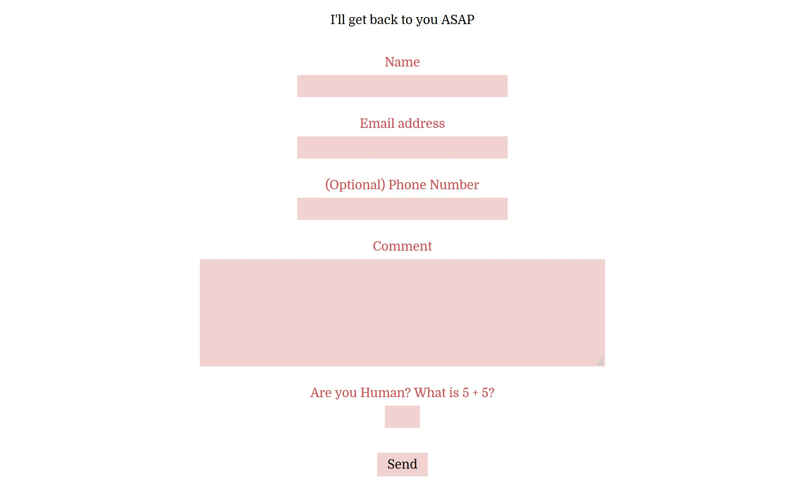

# CONTACT FORM CONTAINER

_An online contact form that is sent to an email._

[See Offsite Demo](http://www.jeffdecola.com/my-php-containers/index.php?page=contact_form_container)

## CONTACT FORM

Complete the form and submit shall send
the information using POST to `/php_scripts/contact_form.php`.

This script will check you are human and email the information.

If there is an error will link to the error page. If everything worked,
it will link to the thank you page.

## TO USE

* Copy and paste the code into your php code
* Change the links
* Update email in `/php_scripts/contact_form.php`
