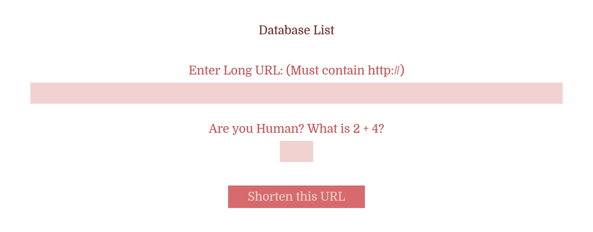

# TINY URL CONTAINER

_Shorten Long URLs to Tiny URLs. Information stored in a mySQLi database._

[See offsite demo](http://www.jeffdecola.com/my-php-containers/index.php?page=jeffs_tiny_url_container)

## EXAMPLE



## OVERVIEW

Enter a Long URL into the form. Submit sends
the Long URL using POST to
[jeffs_tiny_url_shorten.php](https://github.com/JeffDeCola/my-php-containers/blob/master/interaction/jeffs_tiny_url_container/php_scripts/jeffs_tiny_url_shorten.php).

This script will check you are human then creates a `Tiny URL
Unique Number` and send the following to a MySQLi database.

* Date and Time
* The Long URL
* Tiny URL Unique Number

The `Tiny URL Unique Number` (e.g. 1234) is used at the end of your Tiny URL,

```bash
http://yourwebsite.com/s/1234
```

If there is a database error or a form error the script will link
to the appropriate error page.

## TO USE

There are a few steps but I tried to kept it simple.

### PLACE A .htaccess INTO YOUR TINY URL LOCATION

In the location you would like to use the Tiny URL, add the following to your
.htaccess file.

```txt
RewriteRule ^([\w\d]{4})$ php_scripts/jeffs_tiny_url_decoder.php?decode=$1 [L]
```

This calls the php script
[jeffs_tiny_url_decoder.php](https://github.com/JeffDeCola/my-php-containers/blob/master/interaction/jeffs_tiny_url_container/php_scripts/jeffs_tiny_url_decoder.php)
which uses
the `Tiny URL Unique Number` to look up the Long URL.  It then automatically
links to the original webpage.  It's a cool trick.

### CREATE mySQLi DATABASE

Create a mySQLi database on your web server.

### YOUR mySQLi PASSWORD

I created a separate `.php` file to store the password.
I suggest doing this.
Don't worry, you will see this being called in the php code.

```php
    <?php
        $pw = 'YOUR_mySQLi_PASSWORD';
    ?>
```

### COPY PASTE CODE

Copy and paste the php code in this repo (scripts, pages css files).
Update links and configure as desired.

I tried to make this simple, so refer to code on what to update.

As I mentioned above, you will also see I keep a separate
password file for your mySQLi database password. Again, refer
to the php code on what to do.
