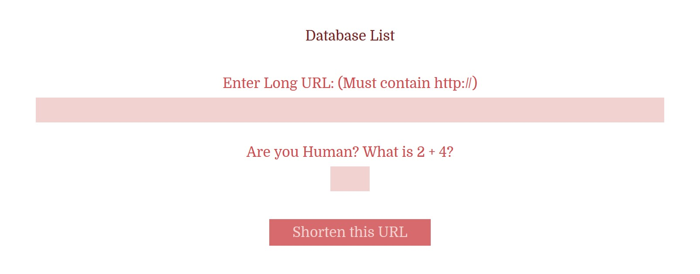

# TINY URL CONTAINER

_Shorten Long URLs to Tiny URLs._

[See Offsite Demo](http://www.jeffdecola.com/my-php-containers/index.php?page=jeffs_tiny_url_container)

## SHORTEN THE URL FORM



Enter a Long URL into the form. Submit shall send
the Long URL using POST to `/php_scripts/jeffs_tiny_url_shorten.php`.

This script will check you are human, creates a `Tiny URL
Unique Number` and send the following to a MySQL database.

* Date and Time
* The Long URL
* Tiny URL Unique Number

The `Tiny URL Unique Number` (e.g. 1234) is used at the end of your Tiny URL.

```bash
http://yourwebsite.com/1234
```

If there is a database error or a form error the script will link
to the error page.

## USING THE TINY URL

In the location you would like to use the Tiny URL, add the following to your
.htaccess file.

```bash
RewriteRule ^([\w\d]{4})$ php_scripts/jeffs_tiny_url_decoder.php?decode=$1 [L]
```

This calls the php script `jeffs_tiny_url_decoder.php` that uses
the `Tiny URL Unique Number` to look up the Long URL.  It then automatically
links to the original webpage.

## TO USE

* Copy and paste the code into your php code
* Create a MySQL database and update `jeffs_tiny_url_shorten.php` and
`jeffs_tiny_url_decoder.php
* Change the links
* Update you .htaccess file
