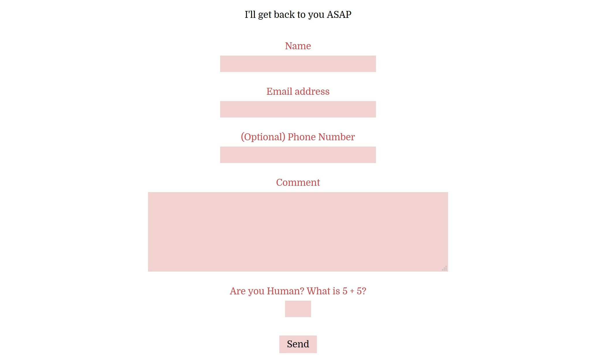

# CONTACT FORM CONTAINER

_An online contact form that is sent to an email using google's reCAPTCHA v3._

Table of Contents

* [EXAMPLE](https://github.com/JeffDeCola/my-php-containers/tree/master/my-php-containers/interaction/contact_form_container#example)
* [OVERVIEW](https://github.com/JeffDeCola/my-php-containers/tree/master/my-php-containers/interaction/contact_form_container#overview)
* [TO USE](https://github.com/JeffDeCola/my-php-containers/tree/master/my-php-containers/interaction/contact_form_container#to-use)

Documentation and Reference

* [offsite demo](http://www.jeffdecola.com/my-php-containers/index.php?page=contact_form_container)

## EXAMPLE

## OVERVIEW

Complete the form and the submit button will send
the information using POST to
[contact_form.php](https://github.com/JeffDeCola/my-php-containers/blob/master/my-php-containers/interaction/contact_form_container/php_scripts/contact_form.php).

Security Features,

* Simple math question
* Google's invisible reCAPTCHA v3

If there is an error will link to
[contact_form_error.php](https://github.com/JeffDeCola/my-php-containers/blob/master/my-php-containers/interaction/contact_form_container/pages/contact_form_error.php).
If everything worked it will link to
[contact_form_thank_you.php](https://github.com/JeffDeCola/my-php-containers/blob/master/my-php-containers/interaction/contact_form_container/pages/contact_form_thank_you.php).

## TO USE

* Get a reCAPTCHA v3
  [site key](https://www.google.com/recaptcha/about/)
  from google and place in
  [contact_form_container.php](https://github.com/JeffDeCola/my-php-containers/blob/master/my-php-containers/interaction/contact_form_container/contact_form_container.php)
* Copy and paste the php container code
  [contact_form_container.php](https://github.com/JeffDeCola/my-php-containers/blob/master/my-php-containers/interaction/contact_form_container/contact_form_container.php)
  into your php code
* Copy the .css file
  [contact_form_container.css](https://github.com/JeffDeCola/my-php-containers/blob/master/my-php-containers/interaction/contact_form_container/css/contact_form_container.css)
* Update links and configure as desired
* Make sure to update your email in
  [contact_form.php](https://github.com/JeffDeCola/my-php-containers/blob/master/my-php-containers/interaction/contact_form_container/php_scripts/contact_form.php)
  or I will get the email. :)
