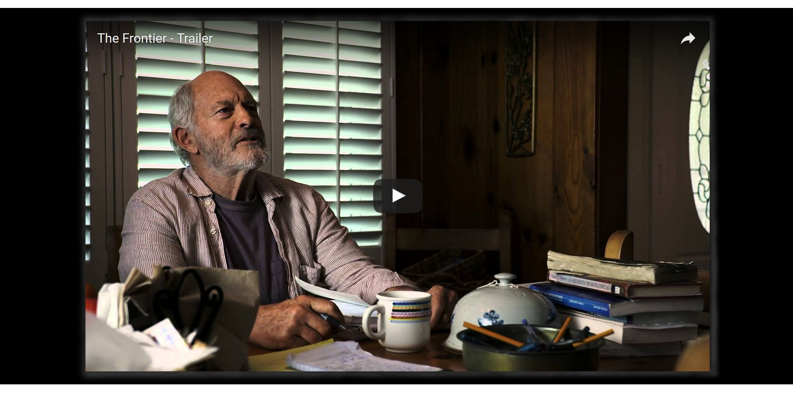

# VIDEO CONTAINER

_A video container for Youtube or Vimeo with an optional background image._

[See offsite demo](http://www.jeffdecola.com/my-php-containers/index.php?page=video_container)

## EXAMPLE

## OVERVIEW

The container uses jquery script `fitVids.js` by Chris Coyier
to size the screen.

## TO USE

* Copy and paste the php container code
  [video_container.php](https://github.com/JeffDeCola/my-php-containers/blob/master/visual/video_container/video_container.php)
  into your php code
* Copy the css file
  [video_container.css](https://github.com/JeffDeCola/my-php-containers/blob/master/visual/video_container/css/video_container.css)
* Update links and configure as desired
